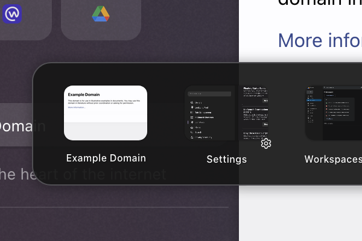

# Zen Mod: Better CtrlTab Panel

Re-style and add customization options for the CtrlTab panel.

[Source code at GitHub](https://github.com/psu/zen-mods)

## v2 - Changes
 - Fixed missing preference _Item - Padding_
 - Added preference _Panel - Border Color_
 - Added preference _Item Label - Color_
 - Added preference _Item Label - Font Family_
 - Added preference _Item Label - Font Weight_
 - Added preference _Item Label - Width Overflow_
 - Added preference _Item Favicon - Background_
 - Update _Favicon - Outdent_ to moves along a diagonal across the preview, set to -150px to position it top-left (instead of Zen's default bottom-right)
